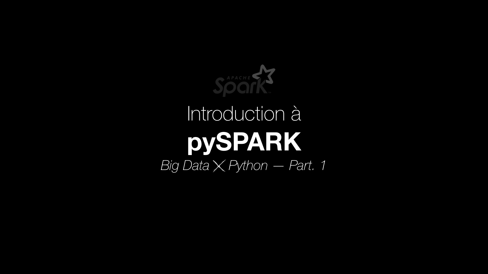

# Big Data *X* Python

*Introduction to pySpark by building a very simple recommender system.*

## What is Spark

When it comes to large amount of data you need specific tools to scale and efficiently handle the processes. A well known tool to do it is Hadoop. 
By distributing the work in partitions between different nodes thanks to his Resiliend Distributed Dataset (RDD), Spark is up to 30 times faster than Hadoop MapReduce for things like sorting.
Moreover, Spark adds some great features like replication of its partitions on different nodes.

Spark works in four steps:
- create a RDD using an external source or a collection,
- apply several transformations to define new RDDs (as RDD is immutable and functions like `map` or `filter` will lead to a transformed RDD creation),
- Ask Spark to keep in memory the different RDDs you'll need thanks to `persist` and `unpersist`,
- Run several actions optimised by Spark like `.count()` or `.collect` that are immediatly stored in memory.

## Run Spark in Google Colab

## Build a recommender system

## Ressources:
- https://arxiv.org/pdf/1606.07792.pdf%20(https://arxiv.org/pdf/1606.07792.pdf)
- http://www.3leafnodes.com/apache-spark-introduction-recommender-system
- https://towardsdatascience.com/pyspark-in-google-colab-6821c2faf41c
- https://github.com/asifahmed90/pyspark-ML-in-Colab/blob/master/PySpark_Regression_Analysis.ipynb